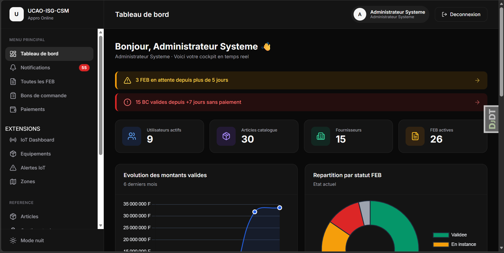
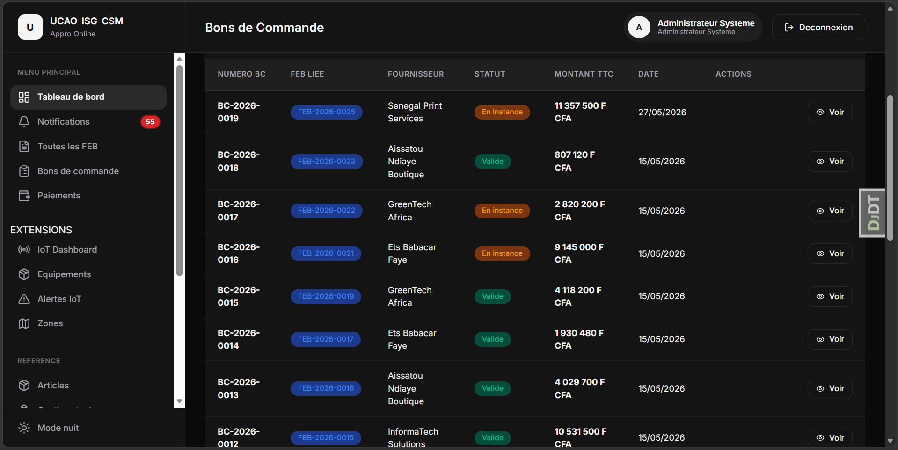
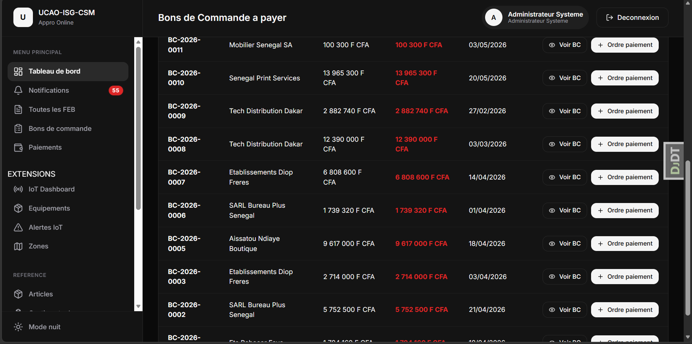
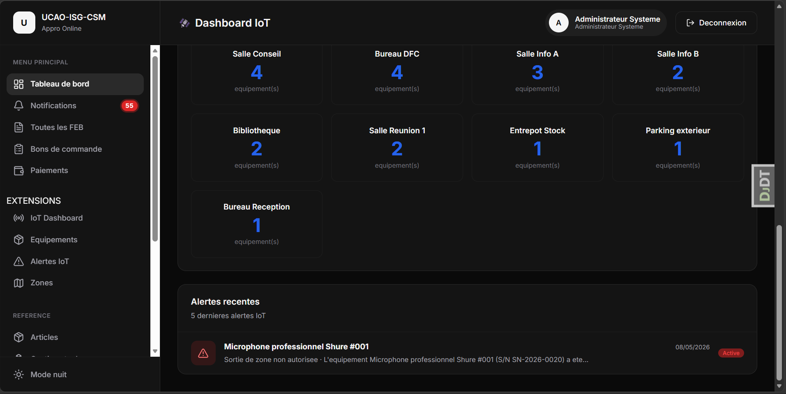
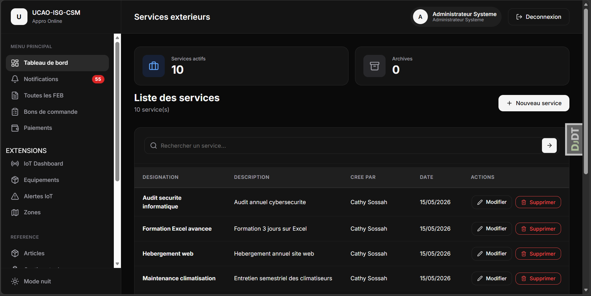
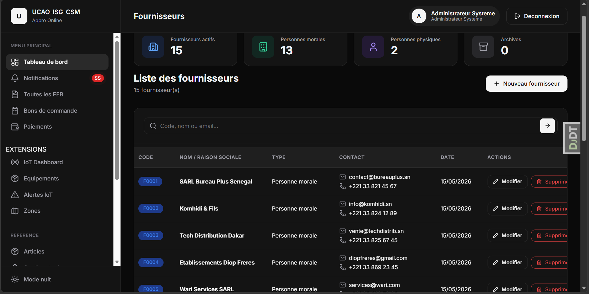

# UCAO Approvisionnements

**Système de Gestion des Approvisionnements en Ligne**

Application web full-stack de digitalisation intégrale du cycle d'approvisionnement de l'Université Catholique de l'Afrique de l'Ouest (UCAO-ISG-CSM). Projet tutoré réalisé en collaboration avec deux encadrants, dans le cadre du Master Informatique de Gestion — MIG 1, 2024/2025.

[](https://www.djangoproject.com/)
[](https://www.python.org/)
[](https://www.postgresql.org/)
[](https://redis.io/)
[](https://docs.celeryq.dev/)
[]()

---

## Table des matières

- [Contexte](#contexte)
- [Fonctionnalités](#fonctionnalités)
- [Stack technique](#stack-technique)
- [Acteurs du système](#acteurs-du-système)
- [Workflow métier](#workflow-métier)
- [Installation](#installation)
- [Comptes de démonstration](#comptes-de-démonstration)
- [Architecture logicielle](#architecture-logicielle)
- [Modèle de données](#modèle-de-données)
- [Endpoints API](#endpoints-api)
- [Sécurité](#sécurité)
- [Tests](#tests)
- [Aperçu](#aperçu)
- [Encadrement](#encadrement)
- [Auteur](#auteur)

---

## Contexte

| Élément | Détail |
|---------|--------|
| Institution | UCAO-ISG-CSM (Université Catholique de l'Afrique de l'Ouest) |
| Filière | Master Informatique de Gestion — MIG 1 |
| Année | 2024 / 2025 |
| Nature | Projet tutoré collaboratif |
| Référence CDC | CG-DFC-CC-01 |
| Objectif | Digitaliser intégralement le cycle des approvisionnements de l'université |

Le système remplace un processus papier long, peu traçable et source d'erreurs, par un workflow entièrement numérique de la demande initiale (FEB) jusqu'au paiement du fournisseur, en passant par la validation multi-niveaux et l'émission du Bon de Commande.

---

## Fonctionnalités

### Modules métier

**A. Comptes et Authentification**
- Authentification bcrypt (cost >= 12)
- 8 rôles distincts avec permissions granulaires
- Blocage automatique après 5 échecs de connexion
- Sessions expirant à 15 min d'inactivité
- Authentification JWT (SimpleJWT) pour l'API

**B. Gestion des Référentiels**
- Articles (avec images) — unité, nature
- Services extérieurs
- Fournisseurs avec code automatique (F0001)
- Devises et taux TVA (0%, 10%, 18%)
- Protection anti-suppression si référencé

**C. Fiches d'Expression des Besoins (FEB)**
- Workflow DRAFT -> EN_INSTANCE -> VALIDÉE
- Numérotation automatique FEB-AAAA-NNNN
- Calcul automatique HT / TVA / TTC
- Lignes dynamiques (articles + services)
- Modification avec motif obligatoire
- Suppression logique (visible 1 an)

**D. Bons de Commande (BC)**
- Génération automatique si montant > 50 000 F CFA
- Numérotation automatique BC-AAAA-NNNN
- Verrouillage `est_verrouille=True` dès la création
- Génération PDF via WeasyPrint
- Signature en PO possible (DFC si DG absent)
- Notification email au fournisseur

**E. Circuit de Paiement**
- 3 niveaux : DFC ordonne -> DG vise -> Comptable exécute
- Vérification automatique du montant versé vs BC
- Paiements partiels (acomptes) avec calcul du solde
- Rejet automatique si montant différent
- Email de confirmation au fournisseur

**F. Administration**
- Création, modification, blocage des comptes
- Réinitialisation mot de passe par email
- Historique complet des actions
- Alertes en cas de blocage (5 échecs)
- Configuration seuil BC et TVA

### Extensions

**Extension IoT**

Suivi RFID UHF / Beacon BLE des équipements.
- Signal capteur toutes les 30 secondes
- API REST sécurisée par token
- Géofencing en moins de 10 secondes si sortie de zone
- Historique de déplacements filtrable
- Statuts : EN_SERVICE / EN_PANNE / MAINTENANCE / SORTI_ZONE
- Alertes push aux Admin et Responsable Approvisionnements

**Extension Prédiction IA**

Anticipation intelligente des besoins de réapprovisionnement.
- Tâche Celery planifiée chaque nuit
- Analyse de l'historique 90 jours (moyenne mobile)
- Détection stock bas -> FEB DRAFT générée automatiquement
- Score de confiance de 0.0 à 1.0
- Ajustement automatique du seuil si rejets consécutifs
- Protection anti-doublon

### Expérience utilisateur

- Mode sombre / clair
- Interface responsive (mobile, tablette, desktop) avec menu burger
- Infinite scroll sur le catalogue articles
- Pills de filtres par catégorie
- Dashboard analytique adaptatif avec 4 graphiques Chart.js
- Notifications in-app et emails HTML transactionnels
- PDF WeasyPrint pour les Bons de Commande

---

## Stack technique

| Couche | Technologies |
|--------|--------------|
| Backend | Django 4.2 LTS, Python 3.12 |
| Base de données | PostgreSQL 15 (contraintes UNIQUE, FK, CHECK) |
| Templates | Jinja2 (rendu côté serveur) |
| API REST | Django REST Framework, JWT (SimpleJWT) |
| Cache et broker | Redis |
| Tâches asynchrones | Celery (emails et analyse prédiction) |
| PDF | WeasyPrint |
| Frontend | HTML5, CSS3, JavaScript vanilla, Chart.js 4.4, Lucide Icons |
| Emails | Gmail SMTP (transactionnel HTML) |
| Tests | Django TestCase (~30 tests) |
| DevOps | Git, GitHub, ngrok |

---

## Acteurs du système

Le système gère 8 rôles internes, 1 acteur externe et 1 acteur non-humain.

| Rôle | Code Django | Type | Responsabilités |
|------|-------------|------|-----------------|
| Resp. Approvisionnements | `resp_appro` | Interne | Créer FEB, gérer référentiels, fournisseurs |
| Chef CCE | `chef_cce` | Interne | Créer FEB pour son centre |
| Chef SLMG | `chef_slmg` | Interne | Créer FEB pour son service |
| Contrôleur de Gestion | `cg` | Interne | Valider ou rejeter les FEB |
| Directeur Financier et Comptable | `dfc` | Interne | Valider FEB/BC, ordonner paiements, gérer devises |
| Directeur Général | `dg` | Interne | Valider BC, viser les paiements |
| Comptable Trésorerie | `comptable` | Interne | Exécuter les paiements |
| Administrateur Système | `admin` | Interne | Gestion utilisateurs, supervision IoT |
| Fournisseur | — | Externe | Reçoit BC + confirmation par email (pas de compte) |
| Capteur IoT | `capteur` | Non-humain | Envoie signaux via API (auth token) |

---

## Workflow métier

```
                      Demandeur crée FEB
                             |
                             v
                       [EN_INSTANCE]
                             |
                        CG / DFC valide
                             |
                     +-------+--------+
                     v                v
                <= 50 000 F        > 50 000 F
                     |                |
                     v                v
                [CLOTUREE]      BC genere (@transaction.atomic)
                                     |
                                     v
                              DG / DFC valide BC
                                     |
                                     v
                             DFC ordonne paiement
                                     |
                                     v
                                DG accorde visa
                                     |
                                     v
                            Comptable execute paiement
                                     |
                              +------+------+
                              v             v
                           Integral      Acompte
                              |             |
                              v             v
                           [PAYE]      [SOLDE_RESTANT]
                              |
                              v
                    Email envoye au fournisseur
```

---

## Installation

### Prérequis

- Python 3.12 ou supérieur
- PostgreSQL 15 ou supérieur
- Redis (pour Celery)
- Git

### Étapes

```bash
# 1. Cloner le dépôt
git clone https://github.com/jean-jacques-komhidi/ucao-approvisionnements.git
cd ucao-approvisionnements

# 2. Créer et activer l'environnement virtuel
python -m venv venv
venv\Scripts\activate           # Windows
source venv/bin/activate         # Linux/Mac

# 3. Installer les dépendances
pip install -r requirements.txt

# 4. Configurer les variables d'environnement
copy .env.example .env           # Windows
cp .env.example .env             # Linux/Mac
# Éditer .env avec les paramètres BD et Gmail

# 5. Créer la base de données PostgreSQL
# Dans psql :
#   CREATE DATABASE appro_ucao;
#   CREATE USER ucao_admin WITH PASSWORD 'votre_mdp';
#   GRANT ALL PRIVILEGES ON DATABASE appro_ucao TO ucao_admin;

# 6. Appliquer les migrations
python manage.py migrate

# 7. Générer les données de démonstration
python manage.py generer_donnees_demo --reset

# 8. Lancer le serveur de développement
python manage.py runserver

# Optionnel : lancer Celery pour les emails asynchrones
celery -A config worker --loglevel=info
```

L'application est ensuite accessible sur [http://127.0.0.1:8000](http://127.0.0.1:8000).

---

## Comptes de démonstration

| Rôle | Identifiant | Mot de passe |
|------|-------------|--------------|
| Responsable Approvisionnements | `cathy.sossah` | `Test1234!` |
| Chef CCE | `moussa.diop` | `Test1234!` |
| Chef SLMG | `fatou.fall` | `Test1234!` |
| Contrôleur de Gestion | `aminata.kane` | `Test1234!` |
| DFC | `ibrahima.ndiaye` | `Test1234!` |
| Directeur Général | `ousmane.sow` | `Test1234!` |
| Comptable | `marieme.gueye` | `Test1234!` |
| Administrateur | `admin` | (défini au setup) |

---

## Architecture logicielle

```
appro_ucao/
├── apps/
│   ├── comptes/                  # Auth, rôles, dashboard analytique
│   │   ├── models.py             # Utilisateur, Session
│   │   ├── views.py
│   │   ├── dashboard.py          # KPI adaptatifs + graphiques Chart.js
│   │   ├── backends.py           # Backend custom (blocage 5 échecs)
│   │   ├── middleware.py         # Expiration session 15 min
│   │   └── management/commands/
│   │       └── generer_donnees_demo.py
│   │
│   ├── referentiels/             # Articles, fournisseurs, devises, stock
│   │   ├── models.py             # Article, Service, Fournisseur, Devise
│   │   ├── services.py           # Génération auto FEB DRAFT (stock bas)
│   │   └── signals.py            # Détection passage sous seuil
│   │
│   ├── approvisionnements/       # FEB, BC, Paiements
│   │   ├── models.py             # FicheExpression, LigneFiche, BC,
│   │   │                         # OrdrePaiement, Paiement
│   │   ├── services.py           # Génération BC, exécution paiement
│   │   └── signals.py            # Numérotation auto FEB/BC/OP/PAY
│   │
│   ├── notifications/            # In-app et emails HTML
│   │   ├── services.py
│   │   └── signals.py            # Cascade auto par événement
│   │
│   └── extensions/
│       └── iot/                  # RFID, géofencing, alertes
│           ├── models.py         # Equipement, Zone, Localisation, Alerte
│           ├── services.py       # Traitement signal capteur
│           └── views.py          # API REST + dashboard IoT
│
├── config/
│   ├── settings/
│   │   ├── base.py               # Configuration partagée
│   │   ├── development.py        # DEBUG + debug-toolbar
│   │   ├── production.py         # DEBUG=False, HTTPS, sécurité renforcée
│   │   └── testing.py            # Base test, hashers rapides
│   ├── urls.py
│   ├── jinja2_env.py             # Filtres personnalisés (fcfa, date_fr)
│   ├── wsgi.py
│   └── asgi.py
│
├── templates/                    # Templates Jinja2
│   ├── base_app.html             # Layout principal (sidebar + burger)
│   ├── comptes/
│   ├── approvisionnements/
│   ├── referentiels/
│   ├── notifications/emails/     # Emails HTML transactionnels
│   └── iot/
│
├── static/                       # CSS, JS, images statiques
│   ├── css/base.css              # Design system complet (var CSS)
│   └── js/base.js
│
├── media/                        # Uploads utilisateurs (images articles)
├── docs/screenshots/             # Captures d'écran de l'application
├── requirements.txt
├── manage.py
└── README.md
```

---

## Modèle de données

Le système comporte 14 classes principales organisées en 5 domaines fonctionnels.

<details>
<summary><b>Authentification (2 classes)</b></summary>

- **Utilisateur** — id, identifiant, mot_de_passe (bcrypt), role, est_actif, tentatives_echecs, email
- **Session** — utilisateur_fk, jeton_jwt, date_expiration, est_actif

</details>

<details>
<summary><b>Référentiels (4 classes)</b></summary>

- **Article** — designation UNIQUE, unite, nature, image, gestion_stock_active, quantite_stock, seuil_alerte
- **ServiceExterieur** — designation UNIQUE, description, est_actif
- **Fournisseur** — code UNIQUE auto (F0001), nom, type_personne, telephone, email, adresse
- **Devise** — code, libelle, taux_tva (0/10/18)

</details>

<details>
<summary><b>FEB et BC (3 classes)</b></summary>

- **FicheExpression** — numero UNIQUE (FEB-AAAA-NNNN), demandeur_fk, fournisseur_fk, type_commande, statut, montant_ht, taux_tva, montant_tva, montant_ttc, validateur_fk, motif_action, est_supprimee, origine, est_auto
- **LigneFiche** — fiche_fk, type_ligne (article/service), quantite, prix_unitaire, montant_ligne
- **BonCommande** — numero UNIQUE (BC-AAAA-NNNN), fiche OneToOne, statut, montant_ttc, validateur_fk, signe_en_po, **est_verrouille**, motif_suppression

</details>

<details>
<summary><b>Paiements (2 classes)</b></summary>

- **OrdrePaiement** — bc_fk, dfc_fk, montant, nature, statut (EN_ATTENTE_VISA / VISA_OK / REJETE_DG), visa_dg, dg_fk, date_visa
- **Paiement** — bc_fk, ordre_fk, comptable_fk, montant_verse, nature, reference, est_acompte, solde_restant, statut

</details>

<details>
<summary><b>Système (2 classes)</b></summary>

- **Historique** — utilisateur_fk, action, entite, entite_id, description, ancienne_valeur (JSONField), nouvelle_valeur (JSONField), date_action
- **Notification** — destinataire_fk, expediteur_fk, type_notif, sujet, message, entite, entite_id, est_lue, email_envoye

</details>

<details>
<summary><b>IoT (4 classes)</b></summary>

- **Equipement** — designation, numero_serie UNIQUE, valeur_acquisition, fournisseur_fk, zone_actuelle_fk, est_suivi_iot, rfid_tag UNIQUE, statut, acces_bloque, token_capteur (généré par `secrets.token_urlsafe(32)`)
- **ZoneGeographique** — nom, batiment, etage, type_zone, est_zone_autorisee
- **Localisation** — equipement_fk, zone_fk, timestamp, signal_force, est_alerte
- **AlerteIoT** — equipement_fk, zone_quittee_fk, type_alerte, timestamp, est_lue, traite_par_fk

</details>

<details>
<summary><b>Prédiction (3 classes)</b></summary>

- **ReglePrediction** — article_fk, seuil_minimum, quantite_cible, frequence_analyse=90, fournisseur_prefere_fk, est_active, derniere_analyse
- **Prediction** — regle_fk, article_fk, quantite_suggeree, fournisseur_suggere_fk, statut, score_confiance (0.0->1.0), date_generation, motif_rejet
- **StockConsommable** — article_fk UNIQUE, quantite_restante, unite, date_maj, maj_par_fk

</details>

---

## Endpoints API

Le système expose plus de 30 endpoints organisés par module.

<details>
<summary><b>Authentification</b></summary>

| Méthode | URL | Description |
|---------|-----|-------------|
| POST | `/connexion/` | Connexion |
| POST | `/deconnexion/` | Déconnexion |
| GET  | `/tableau-de-bord/` | Dashboard adaptatif par rôle |

</details>

<details>
<summary><b>Fiches d'Expression des Besoins</b></summary>

| Méthode | URL | Description |
|---------|-----|-------------|
| GET  | `/feb/mes-fiches/` | Mes FEB (demandeur) |
| GET  | `/feb/en-instance/` | FEB à valider (CG/DFC) |
| POST | `/feb/nouvelle/` | Créer une FEB |
| GET  | `/feb/{id}/` | Détail d'une FEB |
| POST | `/feb/{id}/valider/` | Valider une FEB |
| POST | `/feb/{id}/modifier/` | Modifier avec motif |
| POST | `/feb/{id}/supprimer/` | Suppression logique |

</details>

<details>
<summary><b>Bons de Commande</b></summary>

| Méthode | URL | Description |
|---------|-----|-------------|
| GET  | `/bc/en-instance/` | BC à valider |
| POST | `/bc/{id}/valider/` | Valider (select_for_update) |
| POST | `/bc/{id}/supprimer/` | Suppression cascade |
| GET  | `/bc/{id}/pdf/` | Génération PDF WeasyPrint |

</details>

<details>
<summary><b>Paiements</b></summary>

| Méthode | URL | Description |
|---------|-----|-------------|
| GET  | `/paiements/bc-valides/` | BC à payer |
| POST | `/paiements/ordre/` | Créer ordre de paiement |
| POST | `/paiements/{id}/viser/` | Visa DG |
| GET  | `/paiements/a-executer/` | À exécuter (Comptable) |
| POST | `/paiements/{id}/executer/` | Exécuter le paiement |
| GET  | `/paiements/historique/` | Historique complet |

</details>

<details>
<summary><b>IoT</b></summary>

| Méthode | URL | Description |
|---------|-----|-------------|
| POST | `/api/iot/signal/` | Signal capteur (token auth) |
| GET  | `/iot/equipements/` | Liste équipements |
| GET  | `/iot/equipement/{id}/localisation/` | Position actuelle |
| GET  | `/iot/equipement/{id}/historique/` | Historique déplacements |
| GET  | `/iot/alertes/` | Alertes géofencing |
| PUT  | `/iot/alertes/{id}/traiter/` | Marquer comme traitée |

</details>

<details>
<summary><b>Prédiction</b></summary>

| Méthode | URL | Description |
|---------|-----|-------------|
| GET  | `/predictions/a-valider/` | FEB DRAFT auto générées |
| POST | `/predictions/{id}/valider/` | Valider la prédiction |
| POST | `/predictions/{id}/rejeter/` | Rejeter (avec motif) |
| PUT  | `/predictions/stock/{id}/maj/` | Mise à jour stock |

</details>

---

## Sécurité

Le système implémente les bonnes pratiques OWASP.

| Domaine | Mesure |
|---------|--------|
| Authentification | bcrypt (cost >= 12), JWT SimpleJWT |
| Autorisation | `@login_required` + `@permission_required` sur chaque vue |
| Sessions | Expiration après 15 min d'inactivité (middleware custom) |
| CSRF | Jeton obligatoire sur chaque formulaire POST (Jinja2) |
| Blocage | 5 tentatives échouées -> blocage compte + alerte Admin |
| SQL | ORM Django uniquement (aucune requête SQL brute) |
| Concurrence | `select_for_update()` sur validations critiques |
| Intégrité | `@transaction.atomic` pour opérations multi-tables |
| Traçabilité | Historique complet (JSONField ancien / nouveau) |
| Soft delete | Documents supprimés visibles 1 an (jamais DELETE physique) |
| HTTPS | Obligatoire en production (TLS 1.2+) |
| Secrets | Variables d'environnement (`.env` non commit) |

---

## Tests

```bash
# Lancer tous les tests
python manage.py test --settings=config.settings.testing

# Tests d'une app spécifique
python manage.py test apps.approvisionnements --settings=config.settings.testing

# Avec couverture
pip install coverage
coverage run --source="apps" manage.py test --settings=config.settings.testing
coverage report
coverage html    # Rapport HTML dans htmlcov/index.html
```

**Suite de tests actuelle** : ~30 tests unitaires couvrant :

- Numérotation automatique (FEB, BC, OP, PAY)
- Calculs métier (HT, TVA, TTC)
- Seuil BC 50 000 F CFA
- Génération BC et verrouillage
- Workflow paiement (ordre, visa, exécution)
- Blocage compte après 5 échecs
- Gestion de stock (passage sous seuil -> FEB auto)
- Géofencing IoT (zone autorisée / interdite)
- Tokens capteurs uniques

---

## Aperçu

<table>
<tr>
<td width="50%"><b>Page de connexion</b><br></td>
<td width="50%"><b>Tableau de bord analytique</b><br></td>
</tr>
<tr>
<td><b>Catalogue Articles (infinite scroll)</b><br></td>
<td><b>Création d'une FEB</b><br></td>
</tr>
<tr>
<td><b>Détail FEB (workflow)</b><br></td>
<td><b>Bon de Commande</b><br></td>
</tr>
<tr>
<td><b>Circuit de paiement</b><br></td>
<td><b>Notifications</b><br></td>
</tr>
<tr>
<td><b>Gestion de stock intelligente</b><br></td>
<td><b>Dashboard IoT (géofencing)</b><br></td>
</tr>
</table>

Toutes les captures sont disponibles dans [`docs/screenshots/`](docs/screenshots/).

---

## Documentation technique

Le projet est accompagné d'une documentation UML complète :

- Spécification Fonctionnelle (Word)
- Document de Conception Technique (843 paragraphes)
- Étude comparative architecture et technologies
- Spécification Extension IoT et Prédiction
- Présentation PowerPoint 25 slides
- Diagrammes UML :
  - Cas d'utilisation général + détails FEB / BC
  - Diagramme d'états FEB -> BC -> Paiement
  - 8 Diagrammes de séquence (DS-01 à DS-08)
  - 8 Diagrammes d'activités (DA-01 à DA-08)
  - Diagramme de classes principal (13 classes)
  - Diagramme de classes extension IoT + Prédiction (8 classes)

---

## Encadrement

Ce projet a été réalisé sous la co-direction de deux encadrants pédagogiques auxquels je tiens à exprimer ma profonde gratitude pour leur disponibilité, leurs conseils et leur exigence tout au long du travail.

**Dr Bilong**
Enseignant-chercheur — UCAO-ISG-CSM

**M. Papa Samba TRAORÉ**
Enseignant — UCAO-ISG-CSM
[LinkedIn](https://www.linkedin.com/in/papa-samba-traore-198a82107/)

---

## License

Projet académique — Tous droits réservés UCAO-ISG-CSM, 2024/2025.

---

## Auteur

**KOMHIDI Jean-Jacques**
Master Informatique de Gestion — UCAO-ISG-CSM

- Email : [jkomhidi2002@gmail.com](mailto:jkomhidi2002@gmail.com)
- GitHub : [github.com/jean-jacques-komhidi](https://github.com/jean-jacques-komhidi)

---

## Remerciements

Merci à toute l'équipe pédagogique de l'UCAO-ISG-CSM, à  **Dr Bilong** et **M. Papa Samba Traoré**, pour leur soutien tout au long de ce projet tutoré.
